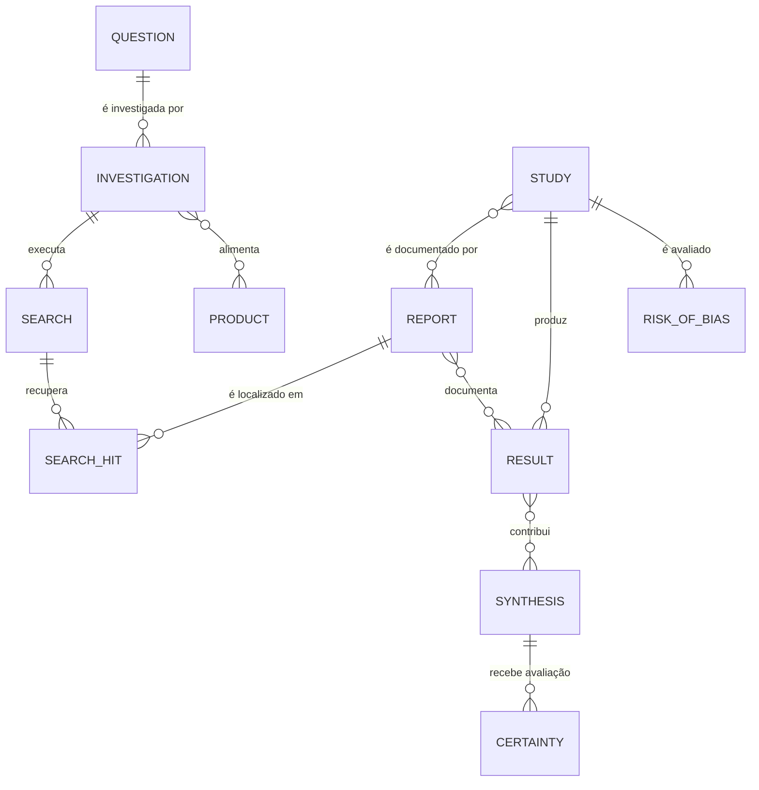

# 20 — Modelo Conceitual de Dados do OES

**Projeto:** Observatório de Evidências em Saúde — OES  
**Status:** Documento vivo — em desenvolvimento  
**Data de consolidação inicial:** 3 de outubro de 2026

## 1. Finalidade

Este documento traduz a metodologia definida nos Documentos 00–15 em um **modelo conceitual de dados**, ainda independente de banco de dados, linguagem de programação ou plataforma tecnológica.

O objetivo é responder:

- quais objetos precisam existir;
- quais objetos representam conhecimento persistente;
- quais representam execução operacional;
- quais são artefatos derivados;
- como esses objetos se relacionam;
- onde devem existir proveniência e versionamento.

> **O modelo de dados deverá representar o método do OES; o método não será simplificado para caber em uma implementação tecnológica prematura.**

---

# PARTE I — PRINCÍPIOS ARQUITETURAIS

## 2. Metodologia antes da implementação

A arquitetura tecnológica será derivada das decisões metodológicas já consolidadas.

Nenhuma escolha de banco de dados deverá alterar silenciosamente conceitos como:

- separação Study × Report;
- múltiplos Results por Study;
- risco de viés em diferentes níveis;
- proveniência por dado;
- síntese como objeto próprio;
- certeza como objeto próprio;
- versionamento;
- data de corte da evidência.

## 3. Identidade antes da apresentação

O modelo deverá distinguir:

- **identidade científica** do objeto;
- **registro operacional** que o processou;
- **representação em produto** apresentada ao usuário.

Exemplo:

`Study ≠ Data Extraction Record ≠ Ficha de Evidência`

## 4. Entidades e registros não serão colapsados

O OES deverá preservar pelo menos três camadas:

1. **entidades de domínio**;
2. **registros de processo**;
3. **artefatos/produtos derivados**.

## 5. Proveniência como requisito transversal

Dados críticos deverão permitir responder:

- de qual Report vieram;
- quem/qual processo extraiu;
- se foram originalmente relatados ou derivados;
- qual transformação foi aplicada;
- em qual versão passaram a ser utilizados;
- em quais sínteses/produtos foram incorporados.

## 6. Versionamento como propriedade do sistema

Objetos persistentes que possam mudar deverão possuir histórico.

Correção editorial, atualização de evidência e mudança de conclusão não serão tratadas como o mesmo evento.

---

# PARTE II — CAMADAS DO MODELO

## 7. Camada A — Objetos científicos persistentes

Representam objetos relativamente estáveis do domínio:

- Question;
- Investigation;
- Study;
- Report;
- Result;
- Synthesis;
- Certainty Assessment.

## 8. Camada B — Registros operacionais

Representam etapas de execução e julgamento:

- Question Record;
- Routing Record;
- Search Record;
- Screening Record;
- Risk of Bias / Critical Appraisal Record;
- Data Extraction Record;
- Synthesis Record;
- Certainty Assessment Record.

Os records não substituem as entidades conceituais que descrevem.

## 9. Camada C — Produtos e objetos de conhecimento

Representam saídas reutilizáveis e comunicáveis:

- Evidence Scan;
- Resposta de Evidência;
- Ficha de Evidência;
- Síntese Rápida;
- Revisão de Evidências;
- Mapa de Evidências;
- Overview;
- Monitor de Evidências;
- Alerta de Evidência.

A Ficha de Evidência permanece **candidata** a unidade persistente central.

## 10. Camada D — Artefatos derivados

Exemplos:

- estratégia de busca;
- conjunto de referências recuperadas;
- fluxograma;
- tabela de características;
- forest plot;
- Summary of Findings;
- Summary of Qualitative Findings;
- script estatístico;
- dataset de análise;
- relatório exportado.

Esses artefatos devem ser vinculados às entidades e processos que os geraram.

---

# PARTE III — ENTIDADES CENTRAIS

## 11. Question

Identificador provisório:

**OES-Q-AAAA-NNNNNN**

Representa uma pergunta científica formalizada.

Atributos conceituais:

- texto original;
- texto normalizado;
- tipo de pergunta;
- estrutura PICO/PECO/PIRD/PICo/etc.;
- população;
- intervenção/exposição/fenômeno;
- comparador;
- outcomes;
- contexto;
- horizonte temporal;
- idioma;
- data de criação;
- status.

## 12. Investigation

Identificador provisório:

**OES-I-AAAA-NNNNNN**

Representa uma execução metodológica destinada a responder uma Question ou conjunto explicitamente relacionado de subperguntas.

Atributos:

- Question ID principal;
- nível N0–N4;
- estado M0–M3;
- objetivo;
- protocolo;
- data de início;
- data de corte;
- status;
- versão;
- equipe/responsáveis.

Uma mesma Question poderá ter mais de uma Investigation ao longo do tempo.

## 13. Search

Identificador provisório:

**OES-S-AAAA-NNNNNN**

Representa uma execução de busca em uma fonte específica ou conjunto operacionalmente indivisível.

Atributos:

- Investigation ID;
- fonte/base;
- estratégia exata;
- filtros;
- plataforma;
- data/hora;
- número recuperado;
- versão da estratégia;
- responsável;
- artefatos de exportação.

Uma Investigation poderá conter muitas Searches.

## 14. Study

Identificador provisório:

**OES-ST-AAAA-NNNNNN**

Representa o **estudo como unidade científica**, independentemente de quantas publicações ou relatórios existam.

Atributos:

- desenho;
- população;
- centros/contexto;
- período;
- tamanho da amostra;
- registro prospectivo, quando existente;
- identificadores externos;
- status.

## 15. Report

Identificador provisório:

**OES-RP-AAAA-NNNNNN**

Representa uma manifestação documental de um Study.

Pode incluir:

- artigo;
- preprint;
- resumo de congresso;
- relatório regulatório;
- protocolo;
- registro;
- dissertação/tese;
- publicação secundária.

Relação central:

**Study N ↔ M Reports**, por meio de `StudyReportLink`.

O caso predominante continuará sendo um Study com múltiplos Reports, mas o modelo deverá suportar Reports que descrevam mais de um Study. O vínculo poderá permanecer inicialmente incerto.

## 16. Result

Identificador provisório:

**OES-RS-AAAA-NNNNNN**

Representa um resultado científico estruturado.

Deverá registrar, conforme aplicável:

- Study ID;
- Report(s) de origem;
- outcome;
- timepoint;
- grupo/comparação;
- estimando;
- medida;
- valor;
- precisão/variância;
- unidade;
- análise ajustada/não ajustada;
- população analisada;
- valor originalmente relatado;
- valor derivado;
- transformação;
- proveniência.

Relação central:

**Study 1 → N Results**

Um Result poderá ter mais de um Report como fonte/proveniência.

## 17. Risk of Bias Assessment

Identificador provisório:

**OES-RB-AAAA-NNNNNN**

Representa um julgamento metodológico realizado com instrumento e versão específicos.

Deverá poder se aplicar a:

- Study;
- Result/outcome;
- domínio específico;
- revisão sistemática, quando a unidade avaliada for revisão.

A relação exata dependerá do instrumento.

## 18. Synthesis

Identificador já definido:

**OES-SY-AAAA-NNNNNN**

Representa uma síntese explícita de Results/Studies para determinada unidade analítica.

Deverá manter:

- Investigation ID;
- Result IDs contribuintes;
- Study IDs;
- população/comparação;
- outcome;
- timepoint;
- estimando/métrica;
- método;
- modelo;
- heterogeneidade;
- sensibilidade;
- software/código;
- versão.

Relação central:

**Result N ↔ M Synthesis**

A relação deverá ser materializada por objeto de contribuição que registre papel, peso e transformação quando aplicável.

## 19. Certainty Assessment

Identificador já definido:

**OES-CE-AAAA-NNNNNN**

Representa avaliação formal de certeza/confiança.

Deverá se vincular a:

- Investigation;
- Synthesis ou Review Finding;
- outcome;
- framework/versão;
- julgamentos por domínio;
- certeza final;
- revisores;
- data/versão.

Uma Synthesis poderá possuir múltiplas versões de Certainty Assessment ao longo do tempo.

---

# PARTE IV — REGISTROS OPERACIONAIS

## 20. Question Record

Registra a entrada e normalização inicial.

Não substitui a entidade Question.

## 21. Routing Record

Registra:

- classificação;
- nível N;
- estado M;
- justificativa;
- eventual escalonamento/redução.

Vincula-se a Investigation.

## 22. Search Record

Registra a execução operacional da Search.

Pode incluir:

- query;
- plataforma;
- filtros;
- contagem;
- export;
- data.

## 23. Screening Record

Registra decisões sobre Reports/registros recuperados.

Estados possíveis deverão preservar:

- inclusão;
- exclusão;
- dúvida;
- não recuperado;
- duplicata;
- relação com Study;
- motivo;
- revisor;
- adjudicação.

## 24. Data Extraction Record

Registra o processo de extração e verificação.

Pode produzir/atualizar:

- Study;
- Report;
- Result;
- atributos de proveniência.

## 25. Risk of Bias Record

É a representação operacional da avaliação que produz um Risk of Bias Assessment.

## 26. Synthesis Record

Registra o processo que produz ou atualiza uma Synthesis.

## 27. Certainty Assessment Record

Registra o processo que produz ou atualiza um Certainty Assessment.

---

# PARTE V — RELAÇÕES E CARDINALIDADES

## 28. Relações fundamentais

### Question → Investigation

**1:N**

Uma pergunta pode ser investigada várias vezes ao longo do tempo.

### Investigation → Search

**1:N**

Uma investigação pode executar múltiplas buscas.

### Search ↔ Report

**N:M**

Um Report pode ser recuperado em várias Searches e uma Search recupera vários Reports/registros.

Será necessário um objeto intermediário conceitual:

**Search Hit / Retrieval Record**

### Study ↔ Report

**N:M**, por meio de **StudyReportLink**.

O caso mais comum é um Study com múltiplos Reports, mas um Report pode excepcionalmente documentar mais de um Study.

### Study → Result

**1:N**

Um estudo pode produzir múltiplos resultados.

### Report ↔ Result

**N:M**

Um resultado pode ser documentado em mais de um Report; um Report pode conter muitos Results.

### Study/Result → Risk of Bias Assessment

**1:N**

A cardinalidade e o nível exato dependem do instrumento.

### Result ↔ Synthesis

**N:M**

Um Result pode participar de múltiplas sínteses.

Objeto intermediário:

**Synthesis Contribution**

### Synthesis → Certainty Assessment

**1:N ao longo do versionamento**

Em determinado estado/versionamento, deverá existir uma avaliação vigente identificável.

### Investigation ↔ Product

**N:M**

Uma Investigation pode alimentar diversos produtos; um produto pode incorporar uma ou mais Investigations.

---

# PARTE VI — OBJETOS INTERMEDIÁRIOS NECESSÁRIOS

## 29. Search Hit / Retrieval Record

Necessário para representar:

- em qual Search uma referência apareceu;
- posição/rank quando relevante;
- identificador importado;
- estado de deduplicação;
- vínculo posterior com Report.

Evita gravar “foi recuperado em PubMed” diretamente no Report como atributo único.

## 30. Report–Study Link

Deverá permitir:

- vínculo confirmado;
- vínculo provável;
- vínculo rejeitado;
- justificativa;
- versão/revisor.

Importante para múltiplas publicações do mesmo estudo.

## 31. Result Source / Provenance Link

Deverá vincular um Result a uma ou mais fontes documentais.

Campos:

- Report ID;
- localização;
- tabela/figura/página;
- texto/valor original;
- método de derivação;
- extrator;
- data.

## 32. Synthesis Contribution

Deverá registrar:

- Synthesis ID;
- Result ID;
- papel;
- transformação;
- peso, se aplicável;
- inclusão/exclusão em sensibilidade;
- justificativa.

---

# PARTE VII — FICHA DE EVIDÊNCIA

## 33. Status arquitetural

A **Ficha de Evidência** permanece candidata a unidade persistente central do conhecimento do OES.

Nesta fase ela não será confundida com:

- Question;
- Investigation;
- Synthesis;
- Certainty Assessment.

## 34. Função candidata

A Ficha poderá funcionar como objeto composto que apresenta o estado vigente de uma questão reutilizável.

Estrutura candidata:

`Question + Investigation vigente + sínteses + certeza + aplicabilidade + conclusão + data de corte + versão`

## 35. Por que não transformá-la em entidade científica primária

A Ficha é uma organização do conhecimento produzido pelo OES.

Study, Report, Result e Synthesis precisam existir independentemente dela para permitir:

- reutilização;
- múltiplos produtos;
- atualizações;
- auditoria;
- prevenção de duplicação.

---

# PARTE VIII — VERSIONAMENTO

## 36. Tipos de mudança

Cada objeto versionável deverá distinguir pelo menos:

- correção editorial;
- correção de dado;
- inclusão de nova fonte;
- inclusão/remoção de Study;
- alteração de Result;
- nova Synthesis;
- mudança de certeza;
- mudança de aplicabilidade;
- mudança de conclusão.

## 37. Version ID

O modelo lógico posterior deverá definir identificador de versão separado do identificador estável da entidade.

Exemplo conceitual:

- `entity_id` = identidade persistente;
- `version_id` = estado específico;
- `valid_from`;
- `supersedes_version_id`.

## 38. Imutabilidade histórica

Versões publicadas não deverão ser sobrescritas silenciosamente.

Correções poderão gerar nova versão com relação explícita à anterior.

---

# PARTE IX — PROVENIÊNCIA

## 39. Proveniência mínima por campo crítico

Para dados capazes de alterar síntese ou conclusão, o sistema deverá suportar:

- fonte;
- localização;
- valor original;
- transformação;
- responsável;
- data;
- regra aplicada;
- versão.

## 40. Valor original × derivado

O modelo deverá armazenar separadamente:

- `reported_value`;
- `derived_value`;
- `derivation_method`;
- `derivation_parameters`.

O valor derivado nunca substituirá silenciosamente o originalmente relatado.

---

# PARTE X — DIAGRAMA CONCEITUAL

## 41. Visão principal

Este diagrama é conceitual e não representa ainda tabelas físicas.

---

# PARTE XI — INVARIANTES ARQUITETURAIS

## 42. Regras que a implementação não poderá violar

1. Study e Report são entidades distintas.
2. Study e Report se relacionam de forma N:M, preservando o caso predominante de múltiplos Reports por Study.
3. Um Study pode possuir vários Results.
4. Result deve preservar proveniência.
5. Valor original e derivado não podem ser colapsados.
6. Search deve ser auditável.
7. Screening deve preservar decisão e motivo.
8. Risk of Bias não é Certainty.
9. Synthesis deve ser entidade explícita.
10. Certainty deve ser entidade explícita.
11. Produtos não devem substituir entidades científicas.
12. Ficha de Evidência é objeto composto candidato, não substituto de Study/Synthesis.
13. Versionamento não pode apagar histórico.
14. Data de corte deve permanecer identificável.
15. IA não pode gerar objeto crítico sem proveniência do processo correspondente.

---

# PARTE XII — IDENTIFICADORES PROVISÓRIOS

## 43. Convenção

| Objeto | Prefixo |
|---|---|
| Question | OES-Q |
| Investigation | OES-I |
| Search | OES-S |
| Study | OES-ST |
| Report | OES-RP |
| Result | OES-RS |
| Risk of Bias Assessment | OES-RB |
| Synthesis | OES-SY |
| Certainty Assessment | OES-CE |
| Product | OES-P |

Formato candidato:

`PREFIXO-AAAA-NNNNNN`

A convenção permanece provisória até o modelo lógico.

---

# PARTE XIII — QUESTÕES ABERTAS

## 44. A decidir na próxima etapa

- Question e subquestion: mesma entidade ou relação hierárquica?
- outcome deve ser entidade própria reutilizável?
- população/intervenção/exposição/comparador devem usar vocabulário controlado próprio?
- como representar revisões sistemáticas como Study/Report versus objeto de síntese externa?
- como representar guideline/HTA/documento regulatório?
- como modelar dados qualitativos e Review Findings?
- Ficha de Evidência deve ser Product subtype ou Knowledge Object próprio?
- Monitoramento deve ser entidade ou serviço vinculado a Product/Question?
- como representar versões simultaneamente vigentes por população/contexto?
- qual granularidade de proveniência por campo será obrigatória em N1–N4?
- quais entidades precisam de estado lógico `current/archived/superseded`?

---

# PARTE XIV — DECISÕES CONSOLIDADAS

## 45. Regras adotadas

1. O modelo conceitual será independente de tecnologia.
2. Entidades científicas, registros operacionais e produtos serão separados.
3. Question e Investigation serão entidades distintas.
4. Study, Report e Result serão entidades distintas.
5. Search terá identidade própria.
6. Result terá proveniência explícita e poderá ser documentado por múltiplos Reports.
7. Synthesis será entidade explícita e reutilizável.
8. Certainty Assessment será entidade explícita e versionável.
9. Relações N:M serão representadas por objetos intermediários quando carregarem informação metodológica.
10. Ficha de Evidência permanecerá candidata a objeto persistente composto.
11. Proveniência e versionamento serão requisitos transversais.
12. O modelo físico somente será definido após validação deste modelo conceitual.

---

# PARTE XV — PRÓXIMA ETAPA

A próxima etapa será desenvolver o **modelo lógico de dados**, começando por:

1. validar entidades e cardinalidades;
2. resolver questões abertas críticas;
3. definir atributos mínimos obrigatórios;
4. formalizar entidades intermediárias;
5. definir estratégia de versionamento;
6. definir regras de identidade e deduplicação;
7. somente depois avaliar implementação física e stack tecnológica.

---

**Documento vivo. Alterações arquiteturais relevantes deverão ser registradas no CHANGELOG.md.**
